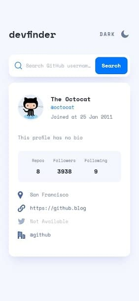
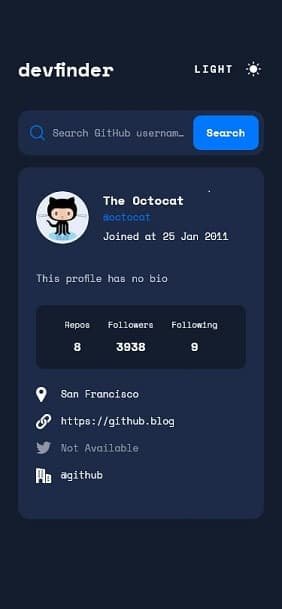
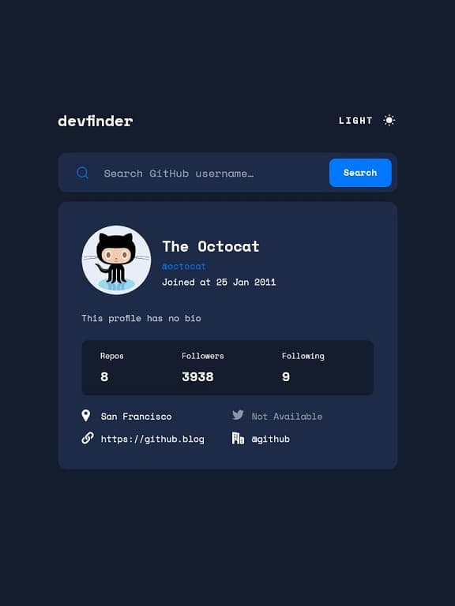
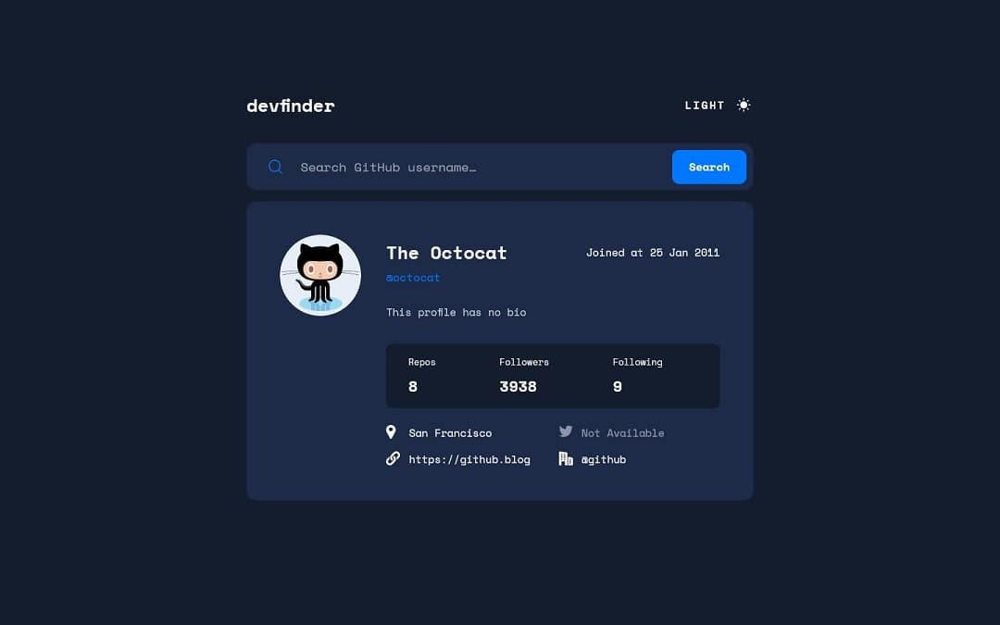
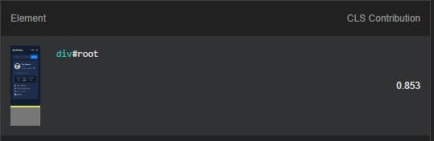
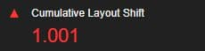
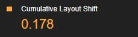

# Frontend Mentor - GitHub user search app solution

This is a solution to the [GitHub user search app challenge on Frontend Mentor](https://www.frontendmentor.io/challenges/github-user-search-app-Q09YOgaH6). Frontend Mentor challenges help you improve your coding skills by building realistic projects! 

## Table of contents

- [Overview](#overview)
  - [The challenge](#the-challenge)
  - [Screenshot](#screenshot)
  - [Links](#links)
- [My process](#my-process)
  - [Built with](#built-with)
  - [What I learned](#what-i-learned)
  - [Continued development](#continued-development)
  - [Useful resources](#useful-resources)
- [Author](#author)

## Overview

### The challenge

Users should be able to:

- View the optimal layout for the app depending on their device's screen size
- See hover states for all interactive elements on the page
- Search for GitHub users by their username
- See relevant user information based on their search
- Switch between light and dark themes
- **Bonus**: Have the correct color scheme chosen for them based on their computer preferences. _Hint_: Research `prefers-color-scheme` in CSS.

### Screenshot

- Solution in mobile 📱:




- Solution in tablet 📱:



- Solution in desktop 💻:



### Links

- Solution URL: [Click here](https://your-solution-url.com)
- Live Site URL: [See live site here](https://juanbonilla.me/FEM_github-user-search-app/)

## My process

### Built with

- Semantic HTML5 markup
- SCSS custom properties
- [CSS Reset](https://www.joshwcomeau.com/css/custom-css-reset/)
- [CUBE CSS](https://piccalil.li/blog/cube-css/) - CSS Methodology
- Flexbox
- CSS Grid
- Mobile-first workflow
- [React v17](https://reactjs.org/) - JS library
- [Redux](https://redux.js.org/) - State management
- [Enzyme](https://enzymejs.github.io/enzyme/) - React testing utility

### What I learned

I've learned a lot while working on this project. Starting with HTML, I was checking if the user was able to navigate my site with the keyboard when I realized that the error message was not getting a focus once it appeared.  This could cause an accessibility issue, for example, users with vision impairment will not know if the search got an error.

To solve this, I included the ```tabIndex``` attribute on my error message with a zero value. The value converts that element in something focusable with a keyboard.

```html
<p 
    datatype={ errorState ? errorState : undefined }
    ref={ errorRef }
    tabIndex='0' 
>No results</p>
```

However, the focus persists in the search button. Then, I needed to set the focus on my error message. I did it using ```useEffect``` and ```useRef```, as you can see in the snippet above, I have the ```datatype``` attribute and when its value is ‘active’ I can set the focus to my error by using its ```ref```.

```js
useEffect(() => {
    if (errorRef && errorRef.current) {
        if (errorState === 'active') {
            errorRef.current.focus();
        }

        if (errorState === 'closing') {
            errorRef.current.addEventListener('animationend', () => {
                setErrorState('');
            }, { once: true });
        }
    }
}, [errorRef, errorState]);
```

Another thing I implemented in this ```useEffect``` was a listener to know when my error needed to disappear. When the search gets valid data and the error is on the screen, a new state will be set to the error: ‘closing’. This value is handled by the effect and it will wait until an animation finishes to finally set the error state back to empty. This operation is convenient when trying to animate ```display: none;```, ```display: block;``` and vice versa.

Apart from that, I had an issue when creating the production build. My images disappeared from my screen when working in the development environment as all of my images were in the /public folder. I came up with the solution by just including ```process.env.PUBLIC_URL``` in the ```src``` attribute of my images.

Speaking of styles, I was curious about [CUBE CSS](https://piccalil.li/blog/cube-css/). This a newer CSS methodology, I was able to implement the concepts of it and understood how useful it would be. I think I reduced some CSS code; however, I would rather choose a different approach for my next project. I added a general file to implement my CSS rules, but I wonder if using this methodology with more partials (i.e for Composition and Utility classes) and placing block element styles in the same folder of its component could become a better maintainable project.

In addition, when I was facing the task of creating the SCSS for both themes, I spent some time until I finally got one way to solve it. I got the idea from Dmitry Borody and his article: [Theming Web Apps with SASS](https://medium.com/@dmitriy.borodiy/easy-color-theming-with-scss-bc38fd5734d1). With the implementation of one mixing, this creates css classes as many as you defined on your themes variable. In my case, it will create two separated classes. One for light and other for dark theme. Below you can see the mixin:

```scss
// $themes is a variable that contains styles for light and dark mode. 
// See: ./src/styles/base/_themes.scss

@mixin themify() {
    @each $theme, $map in $themes {
        
        .theme-#{$theme} & {
            // Defines an empty map to create the required properties with values inside $themes
            $theme-map: () !global;
            @each $key, $submap in $map {
                $value: map-get(map-get($themes, $theme), '#{$key}');
                $theme-map: map-merge($theme-map, ($key: $value)) !global;
            }
            
            // This adds styles inside the new theme classes 
            @content;
            // Setting a variable to null will cause this to disappear in the compiled CSS
            // In this case, we will prevent this variable from being accessed from anywhere
            $theme-map: null !global;
        }
  
    }
}
```

The only thing you need to do is include a function that will get the desired value for that CSS property by sending its key. For instance, in the .bg-primary class I want to get the ```background-color```, so I first wrap all the properties within the mixing. Then I call the themed function as a value with the specific key that is in my ```_themes.scss```. When the mixin creates the two CSS classes it will replace the ```background-color``` value accordingly (*static values in properties won't be changed*):

```scss
@function themed($key) {
    @return map-get($theme-map, $key);
}

.bg-primary {
    @include themify() {
        background-color: themed('background-color-primary');
    }
}

// It returns 
.theme-light .bg-primary {
    background-color: hsla(227, 100%, 98%, 1);
}

.theme-dark .bg-primary {
    background-color: hsla(220, 40%, 13%, 1);
}
```

An interesting SCSS function that I found out was ```unquote```. This one can be used to make calculations and return a valid CSS value. I was thinking of some way to easily add utility classes that depend on a list of values, so I was trying to create margin classes that used a list with values in pixels. But I wanted to convert those pixels into rems and that was the moment for ```unquote``` to come up as follows:

```scss
@each $margin-b in $bottom-margins {
    .mb-#{$margin-b} {
        // Convert pixels into rem
        margin-bottom: unquote(calc($margin-b / 16) + 'rem');
    }
}
```

With respect to Lighthouse, I was facing a performance issue because of CLS. I identified that my ```div#root``` was making a huge contribution to CLS and making it appear red as shown below:





So I started thinking about possible solutions to solve it. I thought of a new ```useEffect``` that would apply a default theme class to the ```body``; although it reduced the CLS contribution, it wasn't enough to have a green score:

```js
useEffect(() => {
    bodyTag.classList.add('theme-light');
}, []);
```



Lastly, I tried applying a default theme class before all the processes. This was the solution needed for the reduction of CLS and even it made a great performance optimization since the score now shows in green.

```js
const bodyTag = document.body;

bodyTag.classList.add('theme-light');

export const ThemeButton = () => { /* Component code... */ };
```


Regarding testing, I had to learn how to mock things such as a fetch response, a redux store, the local storage and user preferences to set light or dark themes. Below you can find how to mock these easily:

```js
// Fetch response mock
const mockResponse = {
    name: 'octocat',
    bio: null,
    company: '@github'
};

global.fetch = jest.fn(() =>
    Promise.resolve({
        json: () => Promise.resolve(mockResponse),
    })
);

// Redux store mock - User data
import configureStore from 'redux-mock-store';

const mockStore = configureStore([]);

const initialState = {};

const store = mockStore({ user: initialState });

// LocalStorage mock. Check src/tests/mocks/localStorage.mock.js
import { localStorageMock } from "../../mocks/localStorage.mock";

// User theme preferences. True refers to light theme due to the condition created in getTheme.js
global.matchMedia = () => ({ matches: true });

// getTheme.js
window.matchMedia("(prefers-color-scheme: light)").matches;
```

### Continued development

This was an awesome challenge to try new stuff. I wanted to try a theme switcher project, but doing this one brought up some questions to me such as: Could using a complex mixin work for other projects? Is there a more efficient strategy in CSS to create theme classes?
 
Also, I recognize that a redux store could not have been the best option to solve state management for this project since it is not a big one. I wonder if using ```useContext``` could have been a better approach that fitted the project goal.
 
Finally, I will keep on learning how to do better unit tests that improves my product quality and using Lighthouse to understand where I can make some improvements that gets me a better score on performance and accessibility

### Useful resources

- [Modern CSS Reset](https://www.joshwcomeau.com/css/custom-css-reset/) - This article is great to consider the implementation of a css reset file. It is greatly explained and provides general knowledge from default browser styling to accessibility points.
- [CUBE CSS](https://piccalil.li/blog/cube-css/) - A great article to understand CUBE CSS methodology with examples, concise information and useful if you want to start with it.
- [A look at the CUBE CSS methodology in action](https://www.youtube.com/watch?v=NanhQvnvbR8) - This video is a good way to start with CUBE CSS by working on a small project.
- [Theming Web Apps with SASS](https://medium.com/@dmitriy.borodiy/easy-color-theming-with-scss-bc38fd5734d1)
- [Accessible SVGs](https://css-tricks.com/accessible-svgs/) - An amazing article that explains how to play with SVGs attributes and other tags to improve accessibility.
- [Animate from display none](https://www.youtube.com/watch?v=4prVdA7_6u0) - This is an interesting video that shows us an example of how to create beautiful interactions with special emphasis in display css property
- [How to optimize CLS](https://web.dev/optimize-cls/?utm_source=lighthouse&utm_medium=devtools#images-without-dimensions) - This article explains how to improve user experience when working with assets, I've found out this information while I was trying Lighthouse when a problem with an image appeared. Here you can understand the importance of 'width' and 'height' HTML attributes and how they will improve your performance
- [How to mock fetch calls with jest](https://medium.com/fernandodof/how-to-mock-fetch-calls-with-jest-a666ae1e7752) - This article brings helpful information when we want to mock fetch responses. In this way, we can make our tests more reliable at the time of testing async operations
- [redux-mock-store](https://github.com/reduxjs/redux-mock-store) - With this library is it possible to easily mock a Redux store, you can use functions as dispatch() or getActions().
- [How to test React Effect Hooks](https://cultivate.software/useeffect/) - I was trying to understand how to test some actions happening inside a useEffect hook, but my tests weren't able to show me what I was looking for. I finally realized that my issue was inside this hook and this article helped me to clarify my thoughts. Plus, this article has a really good example if you want to try TDD methodology.

## Author

- Website - [juanbonilla.me](https://juanbonilla.me)
- Frontend Mentor - [@juanpb96](https://www.frontendmentor.io/profile/juanpb96)
- LinkedIn - [Juan Bonilla](https://www.linkedin.com/in/juan-pablo-bonilla-6b8730115/)
